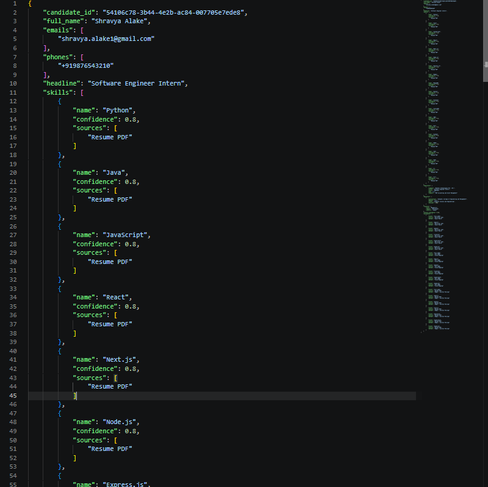
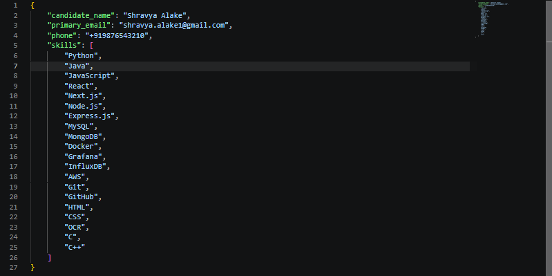
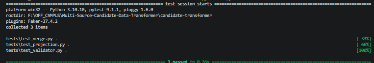

# Multi-Source Candidate Data Transformer

A configurable data transformation pipeline that ingests candidate information from multiple structured and unstructured sources, normalizes and merges conflicting candidate data into a single canonical profile, tracks provenance and confidence, and supports runtime-configurable output schemas.

---

# Implementation covers


| Requirement | Status |
|------------|--------|
| Structured Source Parsing (CSV, ATS JSON) | ✅ |
| Unstructured Source Parsing (Resume PDF) | ✅ |
| Canonical Candidate Profile | ✅ |
| Merge & Conflict Resolution | ✅ |
| Phone & Skill Normalization | ✅ |
| Provenance Tracking | ✅ |
| Confidence Scoring | ✅ |
| Runtime Configurable Output | ✅ |
| Output Validation | ✅ |
| CLI Interface | ✅ |
| Unit Tests | ✅ |

---

# Features

- Parse candidate information from multiple sources
  - Recruiter CSV
  - ATS JSON
  - Resume PDF

- Merge duplicate candidate profiles

- Normalize candidate data
  - Phone numbers (E.164)
  - Canonical skill names

- Deterministic merge strategy

- Provenance tracking for every extracted field

- Confidence scoring

- Runtime configurable output projection
  - Field selection
  - Field renaming
  - Array projection
  - Missing value handling

- Output validation

- Unit tests

---

# Architecture

```
                     +---------------------+
                     | Recruiter CSV       |
                     +----------+----------+
                                |
                     +----------v----------+
                     |     CSV Parser      |
                     +---------------------+

                     +---------------------+
                     | ATS JSON            |
                     +----------+----------+
                                |
                     +----------v----------+
                     |     ATS Parser      |
                     +---------------------+

                     +---------------------+
                     | Resume PDF          |
                     +----------+----------+
                                |
                     +----------v----------+
                     |   Resume Parser     |
                     +---------------------+

                                |
                                v

                     +---------------------+
                     |   Normalization     |
                     | Phone / Skills      |
                     +----------+----------+
                                |
                                v

                     +---------------------+
                     | Canonical Profile   |
                     +----------+----------+
                                |
                                v

                     +---------------------+
                     |   Merge Engine      |
                     +----------+----------+
                                |
                                v

                     +---------------------+
                     | Projection Engine   |
                     +----------+----------+
                                |
                                v

                     +---------------------+
                     | Output Validator    |
                     +----------+----------+
                                |
                                v

                         Final JSON Output
```

---

# Canonical Candidate Schema

```json
{
  "candidate_id": "...",
  "full_name": "...",
  "emails": [],
  "phones": [],
  "location": {},
  "headline": "...",
  "skills": [],
  "experience": [],
  "education": [],
  "provenance": [],
  "overall_confidence": 0.95
}
```

---

# Project Structure

```
candidate-transformer/

├── config/
│   ├── default.json
│   └── custom.json
│
├── docs/
│
├── input/
│   ├── recruiter.csv
│   ├── ats.json
│   └── resume.pdf
│
├── output/
│   ├── default-output.json
│   └── custom-output.json
│
├── src/
│   ├── merger/
│   ├── models/
│   ├── normalizer/
│   ├── parsers/
│   ├── projection/
│   └── validation/
│
├── tests/
│   ├── test_merge.py
│   ├── test_projection.py
│   └── test_validator.py
│
├── README.md
├── requirements.txt
├── .gitignore
└── main.py
```

---

# Installation

Clone the repository

```bash
git clone https://github.com/shravyaalake/Multi-Source-Candidate-Data-Transformer.git

cd candidate-transformer
```

Install dependencies

```bash
pip install -r requirements.txt
```

---

# CLI Usage

| Argument | Description |
|----------|-------------|
| --csv | Recruiter CSV input |
| --ats | ATS JSON input |
| --resume | Resume PDF input |
| --config | Projection configuration |
| --output | Output JSON file |

---

# Running the Project
Use the commands (Default, Custom) below for the output:
## Default Schema

```bash
python main.py \
--csv input/recruiter.csv \
--ats input/ats.json \
--resume input/resume.pdf \
--config config/default.json \
--output output/default-output.json
```

---

## Custom Schema

```bash
python main.py \
--csv input/recruiter.csv \
--ats input/ats.json \
--resume input/resume.pdf \
--config config/custom.json \
--output output/custom-output.json
```

---

# Runtime Configurable Projection

The projection layer reshapes the canonical profile **without changing application code**.

Supports:

- Field selection
- Field renaming
- Nested field mapping
- Array projection
- Missing value handling
- Confidence/provenance toggling

Example

```json
{
  "fields": [
    {
      "path": "candidate_name",
      "from": "full_name"
    },
    {
      "path": "primary_email",
      "from": "emails[0]"
    },
    {
      "path": "skills",
      "from": "skills[].name"
    }
  ],
  "include_confidence": false,
  "include_provenance": false,
  "on_missing": "omit"
}
```

---

# Merge Strategy

Profiles are merged deterministically using the following policy.

| Field | Merge Policy |
|------|---------------|
| Name | Prefer longer non-empty value |
| Emails | Remove duplicates |
| Phones | Normalize to E.164 then deduplicate |
| Skills | Canonicalize then merge |
| Experience | Remove duplicate entries |
| Education | Merge unique records |
| Confidence | Highest confidence wins |
| Provenance | Preserve every contributing source |

Priority order:

1. Recruiter CSV
2. ATS JSON
3. Resume PDF

---

# Provenance Tracking

Every extracted field records

- Source
- Extraction Method

Example

```json
{
  "field":"emails",
  "source":"Resume PDF",
  "method":"Regex + Section Parsing"
}
```

---

# Confidence Policy

| Source | Confidence |
|---------|-----------|
| Recruiter CSV | 0.95 |
| ATS JSON | 0.90 |
| Resume PDF | 0.80 |

The merged profile preserves the highest confidence for trusted values.

---

# Deterministic Processing

The pipeline is deterministic.

Given identical input files and runtime configuration, the transformer always produces the same canonical output.

Every field in the final profile is fully traceable through provenance metadata.

---

# Error Handling

The pipeline degrades gracefully.

- Missing sources never crash execution
- Missing values become null or are omitted
- Invalid fields are ignored
- Unknown information is never fabricated

---

# Validation

The validator checks

- Required fields
- Expected data types
- Runtime projection rules
- Missing value policy

---

# Scalability

The pipeline processes candidate records independently and performs deterministic merging.

The design scales linearly with the number of candidate profiles, making it suitable for batch processing thousands of candidates.

---

# Testing

Run all tests

```bash
python -m pytest
```

Expected output

```
=========================
3 passed
=========================
```

---

# Sample Outputs

## Default Output

```json
{
  "full_name":"Shravya Alake",
  "emails":["shravya.alake1@gmail.com"],
  "phones":["+919876543210"]
}
```

---

## Custom Output

```json
{
  "candidate_name":"Shravya Alake",
  "primary_email":"shravya.alake1@gmail.com",
  "skills":[
    "Python",
    "Docker",
    "React"
  ]
}
```

---

# Screenshots

### Default Output



### Custom Output



### Tests



---

# Assumptions

- Candidate uniqueness is determined through merged profile logic.
- Resume parsing uses deterministic regex and section parsing.
- Phone numbers are normalized to E.164.
- Unknown values are never fabricated.
- Missing values follow runtime configuration.

---

# Future Improvements

- LinkedIn API integration
- GitHub API integration
- OCR for scanned resumes
- LLM-assisted entity extraction
- Confidence calibration
- Parallel batch processing
- Docker containerization
- GitHub Actions CI/CD

---

# Tech Stack

- Python
- Pandas
- Pydantic
- pdfplumber
- phonenumbers
- pytest

---

# Test Results

```
========================================
3 tests passed successfully
========================================
```

---

## Author

**Shravya A**

GitHub: https://github.com/shravyaalake

LinkedIn: https://linkedin.com/in/shravya-a-39278326a